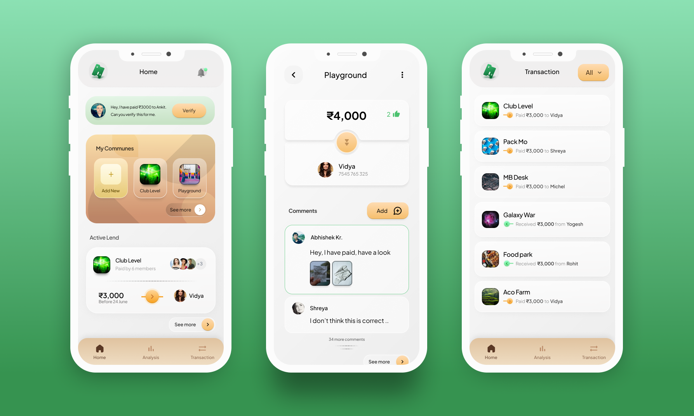

# Part of Hundi: Record Book

## [Download main app on Google Play here](https://play.google.com/store/apps/details?id=com.hundi.social)

 

Hundi: Record Book is made using Flutter 3.10. This powerful app simplifies the management of period-based Hundi and Committee group, allowing you to effortlessly log and track transactions, payments, and contributions made by group members.

`Here we are adding codes from original app, so that other developers can look into and follow the good treads`

## Features

### Dynamic Theme and Theme Extention 
- Dynamic Theme color implementation using change notifier. Check [AppThemeProvider](lib/ui/res/theme/app_theme_provider.dart)
- ThemeExtension implmentation in [AppThemeColor](lib/ui/res/theme/app_theme_colors.dart)
- Setup of AppThemeProvider and AppThemeColor in [main.dart](lib/main.dart)
- For more detail : [Read the blog](https://dev.to/nirajprakash/flutter-themes-dynamic-color-themeextension-4lfp)  

